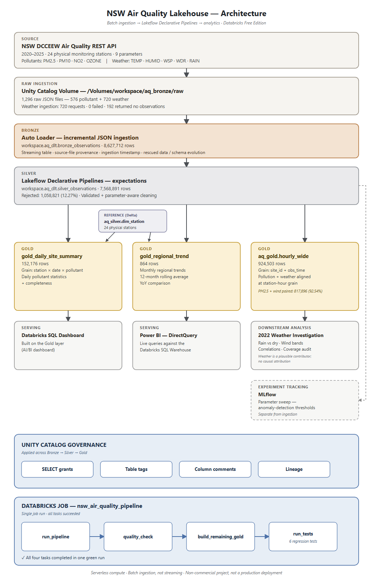
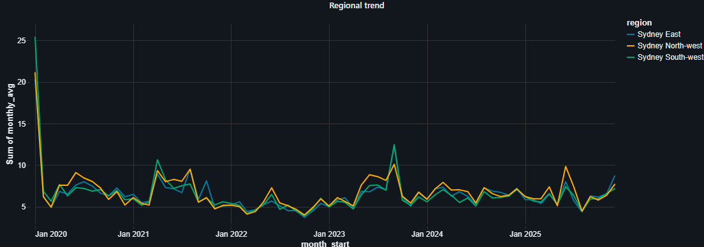

# NSW Air Quality Lakehouse

A Databricks lakehouse over the NSW DCCEEW Air Quality REST API, 2020–2025: 24
physical Sydney monitoring stations, 9 parameters (4 pollutants, 5 weather).
Raw JSON lands in a Unity Catalog Volume, is ingested incrementally with Auto
Loader, and is cleaned and modelled Bronze → Silver → Gold in a Lakeflow
Declarative Pipeline, gated by an automated quality check and a six-test
regression suite, and orchestrated by a single Databricks Job.

The project was built in two phases. It started as a pollutant-only batch
pipeline (plain PySpark writes, `notebooks/`) that produced most of the
anomaly-detection, event-detection and MLflow findings below. It was then
rebuilt as the current Lakeflow Declarative Pipeline and extended with five
weather parameters — an extension that exposed a real bug in the original
cleaning rule (see [Data quality and engineering findings](#data-quality-and-engineering-findings)).
The **Architecture**, **Dataset**, **Lakehouse pipeline**, **Testing** and
**Governance** sections below describe the current Lakeflow implementation.
Findings from the original build are preserved and labeled where they still
hold.

Built on Databricks Free Edition. Personal project, non-commercial, not a
production deployment.

**Stack:** Databricks · PySpark · Spark SQL · Delta Lake · Auto Loader ·
Lakeflow Declarative Pipelines · Unity Catalog · Databricks Jobs · MLflow ·
Databricks SQL · Power BI

---

## Contents

- [Architecture](#architecture)
- [Dataset](#dataset)
- [Lakehouse pipeline](#lakehouse-pipeline)
- [Data quality and engineering findings](#data-quality-and-engineering-findings)
- [Analytical findings](#analytical-findings)
- [Testing](#testing)
- [Governance](#governance)
- [Serving and reporting](#serving-and-reporting)
- [Experiment tracking](#experiment-tracking)
- [Limitations](#limitations)
- [Repository structure](#repository-structure)

---

## Architecture



A full write-up of every layer, with grain and row counts, is in
[docs/architecture-diagram.md](docs/architecture-diagram.md).

| Layer | What it does |
|---|---|
| Source | NSW DCCEEW Air Quality REST API, queried in station/parameter/year chunks. A request/response REST API, not a streaming feed. |
| Raw | JSON landed unchanged in a Unity Catalog Volume (`/Volumes/workspace/aq_bronze/raw`). |
| Bronze | Auto Loader reads the Volume incrementally into `workspace.aq_dlt.bronze_observations`, adding source-file provenance and an ingestion timestamp. Nothing is cleaned here. |
| Silver | A Lakeflow Declarative Pipeline flattens the API structure, corrects the timestamp, and applies named, parameter-aware expectations into `workspace.aq_dlt.silver_observations`. |
| Gold | Three tables built from Silver: `gold_daily_site_summary`, `gold_regional_trend`, `aq_gold.hourly_wide`. |
| Orchestration | One Databricks Job, four tasks, gated by an automated quality check and a six-test regression suite. |
| Governance | Unity Catalog: grants, tags, column comments, lineage. |

---

## Dataset

| Metric | Value |
|---|---|
| Source | NSW DCCEEW Air Quality Monitoring Network REST API |
| API docs | https://data.airquality.nsw.gov.au/docs/index.html |
| Period | 2020–2025 |
| Physical Sydney stations | **24** |
| Parameters | **9** — 4 pollutants + 5 weather |
| Pollutants | PM2.5, PM10, NO2, OZONE |
| Weather | TEMP, HUMID, WSP, WDR, RAIN |
| Granularity | Hourly |

> **24 is the total count of physical stations.** A different, smaller number —
> 19 — appears later in this README: it is the number of stations with any
> paired PM2.5 + wind observations in the weather-coverage analysis, not the
> station count. The two are not interchangeable.

### Ingestion

| Metric | Value |
|---|---|
| Raw files | **1,296** — 576 pollutant + 720 weather |
| Pollutant chunks | 576 (24 stations × 4 pollutants × 6 years), 0 failed |
| Weather chunks | 720 (24 stations × 5 parameters × 6 years) — 720 requests, **0 failed**, **192 returned no observations** |
| Raw storage | `/Volumes/workspace/aq_bronze/raw` |

Each chunk is one station, one parameter, one year — sized that way because a
wider request (six pollutants for one station-year) returned HTTP 502 from the
upstream server. An empty chunk (192 of the weather ones) means that
station/parameter/year combination has no observations, not a failure —
requests are retried three times with exponential backoff, and every chunk is
recorded to a manifest table built by re-reading the landed files, which
survives a session restart.

Two of the 26 "Sydney region" entries the API returns are regional aggregates,
not physical stations (null coordinates, `SiteName` identical to `Region`).
They are excluded before the 24-station chunk plan is built, to avoid
double-counting in every regional average.

---

## Lakehouse pipeline

### Bronze

Auto Loader (`cloudFiles`, JSON, schema evolution mode `rescue`) reads the
landed files incrementally into `workspace.aq_dlt.bronze_observations` as a
streaming table.

| Metric | Value |
|---|---|
| Table | `workspace.aq_dlt.bronze_observations` |
| Rows | **8,627,712** |

Two columns are added — `_ingested_at`, `_source_file` — and nothing else. The
nested `Parameter` struct and every value stay exactly as the API returned
them, so any downstream logic change can be replayed from these rows without
re-querying the API.

### Silver

A Lakeflow Declarative Pipeline flattens the struct, corrects the API's
1-based `Hour` field, constructs `obs_time`, and applies five named
expectations (`valid_site`, `valid_date`, `valid_hour`, `has_reading` — drop
on failure; `above_detection_floor` — track without dropping) into
`workspace.aq_dlt.silver_observations`.

| Metric | Value |
|---|---|
| Table | `workspace.aq_dlt.silver_observations` |
| Rows | **7,568,891** |
| Rejected by expectations | **1,058,821** |
| Drop rate | **12.27%** |

Rejected rows are dropped at the Silver boundary by the pipeline's
`expect_or_drop` expectations — there is no separate physical quarantine
table in the current implementation. `bronze = silver + rejected` is the
reconciliation identity, checked by the Job's `quality_check` task and by
regression test 2 (`pipeline_accounting`).

**Grain:** one row per `site_id` + `parameter_code` + `obs_time`, proven by
regression test 3 (`silver_grain_unique`).

### Reference: `dim_station`

`workspace.aq_silver.dim_station` (24 rows, one per physical station) is a
small Delta reference table. It is joined into the two aggregate Gold models
for station name, region and coordinates — it is **not** a source for Silver.

### Gold

Three tables, all built from Silver:

| Table | Grain | Rows | Purpose |
|---|---|---|---|
| `gold_daily_site_summary` | station × date × pollutant | **152,176** | Daily pollutant statistics and hourly completeness |
| `gold_regional_trend` | region × month × pollutant | **864** | Monthly regional trend, 12-month rolling average, year-on-year comparison |
| `aq_gold.hourly_wide` | `site_id` + `obs_time` | **924,503** | Pollution and weather pivoted onto one row per station-hour |

`hourly_wide` is a wide pivot of `silver_observations` — one column per
parameter (`pm25`, `pm10`, `no2`, `ozone`, `temp_c`, `humidity`, `wind_speed`,
`wind_dir`, `rainfall`) at `site_id` + `obs_time` grain, proven unique by
regression test 5 (`hourly_wide_grain`). It exists specifically to let
pollutant and weather values be compared on the same row, and is the source
table for the [2022 weather investigation](#2022-weather-investigation) below.

---

## Data quality and engineering findings

The project's strongest material is where an assumption was tested and shown
to be wrong, then corrected. Nothing here is hidden.

### The 1-based hour, and an exclusive end date

Two ingestion-level bugs, both caught by testing rather than assuming:

- The API's `Hour` field is 1-based (`Hour=1` carries `HourDescription`
  "12 am – 1 am"), not 0-based. Uncorrected, every timestamp would be shifted
  by one hour. Silver subtracts 1 before building `obs_time`
  (`hour_1based - 1 = obs_hour`), and regression test 1
  (`hour_offset_corrected`) asserts that `obs_hour` spans exactly 0–23 and
  that every Hour-1 reading maps to midnight.
- `EndDate` is exclusive: a window ending `2024-01-31` returns data only
  through `2024-01-30`. Requests use the first day of the following year to
  compensate — left uncorrected, this would have silently dropped one day per
  station-parameter-year across the dataset.

### Parameter-aware cleaning: pollutants vs. weather

**This is the project's central data-quality finding, and it only surfaced
once weather was added.**

The original cleaning rule floored every negative value at zero, on the
reasoning that a negative pollutant concentration is physically impossible and
almost always represents a below-detection-limit reading from a particulate
instrument — a real, documented characteristic of these sensors, not sensor
error. That rule was measured directly against the original pollutant-only
build and found to bias every pollutant's mean upward, because every negative
reading was a *low* one:

| Pollutant | Mean with universal floor | Mean after parameter-aware fix | Overstatement |
|---|---|---|---|
| PM2.5 | 7.196 | 6.324 | **12.1%** |
| NO2 | 0.685 | 0.636 | 7.2% |
| OZONE | 1.784 | 1.755 | 1.6% |
| PM10 | 15.593 | 15.356 | 1.5% |

*(Measured on the original pollutant-only Silver build, before weather was
added — `notebooks/Silver Layer.ipynb` / `Gold Layer.ipynb`.)*

Applying that same universal rule to weather would have been actively wrong:
temperature legitimately goes negative. The current Silver pipeline applies
the rule **per parameter** instead of globally:

- **Pollutants** (`PM2.5`, `PM10`, `NO2`, `OZONE`): the raw `value` is
  preserved; `below_detection` is flagged `true` when `value < 0`; the
  analytical `value_clean` is floored at zero.
- **Weather**: `value` and `value_clean` are identical — nothing is floored,
  nothing is rewritten. Legitimate negative readings are preserved exactly as
  received.

Verified on the current build: **590 negative temperature observations are
preserved unchanged**, with a minimum of **-3.609 °C**. Regression test 4
(`value_clean_semantics`) asserts all four of: zero negative `value_clean`
rows among pollutants, at least one `below_detection` pollutant row, at least
one negative `TEMP` reading, and zero altered negative `TEMP` rows.

### Humidity: source fidelity vs. analytical fitness for purpose

A related but distinct problem: relative humidity is bounded 0–100% by
definition, but the source data contains readings above that.

| Metric | Value |
|---|---|
| Total `HUMID` observations (Silver) | **918,454** |
| Above 100% | **16,644** (**1.8122%**) |
| Maximum source value | **113.839%** |

These are not floored or rewritten in Silver — Silver's job is to preserve
what the instrument reported, for provenance and auditability, not to decide
what's usable. The decision about usability is made one layer up: `hourly_wide`
exposes `humidity` only where the source value falls in 0–100, everything else
becomes `NULL` in that column.

| Metric | Value |
|---|---|
| Valid analytical humidity rows (`hourly_wide`) | **901,810** |
| Analytical humidity range | **0–100** |

Regression test 6 (`humidity_semantics`) asserts both halves of this decision
in one place: that Silver still contains the known >100 values (so the source
data hasn't been silently rewritten), and that `hourly_wide.humidity` never
exceeds the range 0–100.

### Flatline detector: a 100% false-positive rate

A flatline detector (six or more identical consecutive hourly readings at one
station) was built against the original pollutant-only Silver table. It
returned 4,287 runs.


*Every one of the 4,287 runs sits at value 0.0.*

All 4,287 were artifacts of the floor-at-zero rule described above: flooring
negatives turns a run of below-detection readings into an apparent flatline.
Re-running identical logic against the raw `value` column, excluding zeros:


*4,287 false positives against zero genuine runs of six or more hours.*

No instrument in the network repeated an identical non-zero reading for six or
more consecutive hours across six years. The detector's entire output had been
created by a preprocessing decision made upstream of it — the same underlying
lesson as the pollutant-cleaning finding above, found independently.

### Wind direction is a circular variable

`WDR` is measured in degrees, 0–360, and wraps around (0° and 360° are the
same direction). It is deliberately never averaged arithmetically or
correlated with ordinary Pearson correlation in this project — doing so would
treat due-north wind as maximally different from itself. Where wind direction
matters to a finding below, it is handled by banding wind *speed* instead, or
left out of correlation analysis entirely.

### Idempotent MERGE upserts

Demonstrated idempotent Delta MERGE upserts using station, parameter and
observation timestamp (`site_id`, `parameter_code`, `obs_time`) as the match
key, against a one-week slice of Silver (11,620 rows). Replaying the identical
source batch through the same `MERGE ... WHEN MATCHED THEN UPDATE ... WHEN NOT
MATCHED THEN INSERT` did not increase the row count — confirming the match key
gives safe re-runs rather than duplicate inserts. This is a standalone
demonstration (`Queries/Merge Demo.dbquery.ipynb`); Auto Loader's own Bronze
ingestion does not use this MERGE.

---

## Analytical findings

The findings below (anomaly detection, flatline, event detection, MLflow,
exceedance, regional variation) were computed on the **original pollutant-only
Silver/Gold build** (`workspace.aq_silver.fact_observation`,
`workspace.aq_gold.*`, `notebooks/`). They remain valid observations about the
four pollutants and are preserved here; the numbers are not re-derived from
the current weather-inclusive `aq_dlt` tables. The final subsection, the 2022
weather investigation, is the one analysis run on the current `hourly_wide`
table.

### Point-level anomalies

Every reading scored against a rolling 7-day baseline for the same station and
pollutant (excluding the current reading from its own baseline), because a
global threshold fails twice over: it flags every reading at a genuinely
polluted station and misses a quiet station doubling from 5 to 10.


| Class | Rows | % |
|---|---|---|
| normal | 3,456,427 | 98.56 |
| unusual (\|z\| > 3) | 43,317 | 1.24 |
| extreme (\|z\| > 5) | 7,125 | 0.20 |
| insufficient_history | 160 | 0.00 |

**Sensor health**, rolled up to station-month:

| Status | Station-months | % |
|---|---|---|
| healthy | 4,476 | 88.1 |
| gappy | 555 | 10.9 |
| poor_coverage | 40 | 0.8 |
| suspect | 8 | 0.2 |

### Fault vs. event discrimination

> An anomaly at a single station is an instrument problem. The same anomaly
> occurring simultaneously across many stations is a real air quality event.
> Sensor faults are independent; air masses are not.

Each hour classified by what fraction of reporting stations were
simultaneously anomalous:

| Class | Hours | % | Interpretation |
|---|---|---|---|
| quiet | 180,918 | 87.43 | No anomalies |
| isolated_fault | 15,747 | 7.61 | One station — instrument problem |
| localised | 7,445 | 3.60 | Under 25% — a nearby source |
| widespread | 1,937 | 0.94 | 25–50% — regional event |
| network_wide | 497 | 0.24 | Over 50% — severe regional event |
| insufficient_network | 382 | 0.18 | Fewer than 3 stations reporting |

Isolated single-station anomalies outnumber genuine regional events roughly
6.5 to 1 — treating both as generic "outliers" would have misattributed most
of them.

### January 2020: two baselines, two different answers

The Black Summer bushfire smoke is visible in the regional trend without any
detection logic (Sydney East/North-west/South-west PM2.5 all 3–4× the
following months in January 2020). The two anomaly detectors disagree on how
well they caught it, and both results are kept because the disagreement is
itself the finding:

- **The rolling 7-day baseline did not catch the worst of it.** It ranked
  January 2020 second by event-hours (36), behind August 2020 (40). On 12
  January the network averaged 47.1 µg/m³ PM2.5 — nearly twice the daily
  standard — with **zero** stations flagged anomalous, because by then the
  7-day window had adapted to the smoke and absorbed it into what looked
  normal.

  

  *8 January: 76.7 µg/m³, 9 stations flagged. 12 January: 47.1 µg/m³, zero
  stations flagged.*

- **A seasonal baseline caught it decisively.** Comparing each reading against
  the same calendar month in other years, at the same station:

  

  | Month | Mean seasonal z | Extreme readings |
  |---|---|---|
  | **Jan 2020** | **1.08** | **1,083** |
  | Sep 2023 | 0.47 | 634 |
  | Apr 2021 | 0.42 | 368 |

The conclusion is not that the rolling detector "validated" the event — it
demonstrably missed the worst day of it. The conclusion is that **the choice
of baseline determines what a detector can see**: a 7-day rolling window is
blind to events that last longer than about a week, and a seasonal comparison
is not.

### MLflow parameter sweep

Twenty configurations tracked in MLflow — five z-score thresholds × four
baseline window sizes — measuring how many January 2020 anomalies each
detected, run against the original pollutant-only Silver table.


The result contradicted the initial hypothesis that a wider window would
recover detections lost to baseline adaptation. It did the opposite:

| Window | Jan 2020 anomalies (z=2.5) | Share of all anomalies | Overall anomaly rate |
|---|---|---|---|
| 72h | 573 | 1.95% | 3.33% |
| 168h | 400 | 1.51% | 2.99% |
| 336h | 344 | 1.42% | 2.74% |
| 720h | 297 | 1.29% | 2.61% |

Monotonic decline on both measures, at every threshold tested — a wider
window admits more variety into the baseline, inflates its standard
deviation, and suppresses detections everywhere. The most useful
configuration for isolating extreme events was the strictest, shortest
setting: z = 5.0 at 72 hours gave January 2020 a 5.15% share of all
anomalies, four times the worst configuration's 1.29%.


### Exceedance days

| Year | PM10 days | PM2.5 days |
|---|---|---|
| 2020 | 132 | 144 |
| 2021 | 18 | 52 |
| 2022 | 0 | 0 |
| 2023 | 17 | 54 |
| 2024 | 1 | 6 |
| 2025 | 18 | 16 |

2020 accounts for 144 of 272 PM2.5 exceedance days across six years, and 132
of 186 PM10 days; 2022 recorded none. **Caveat:** thresholds used (25 µg/m³
PM2.5, 50 µg/m³ PM10) are illustrative NEPM-style values, not cited
regulatory figures, and days under 75% hourly completeness are excluded.

### Regional variation and a six-year trend

| Region | PM2.5 | PM10 | Stations |
|---|---|---|---|
| Sydney North-west | 6.71 | 16.12 | 6 |
| Sydney South-west | 6.49 | 14.77 | 5 |
| Sydney East | 6.46 | 15.29 | 8 |

PM2.5 varies by under 4% across regions on this build — the station counts
differ (8/6/5), so each regional mean rests on a different sample size, and
the spread is small enough that station placement could plausibly account for
it on its own.

| Year | PM2.5 | PM10 | NO2 | OZONE |
|---|---|---|---|---|
| 2020 | 8.01 | 17.80 | 0.65 | 1.84 |
| 2021 | 6.75 | 15.18 | 0.60 | 1.69 |
| 2022 | 5.02 | 12.16 | 0.58 | 1.58 |
| 2023 | 6.79 | 15.86 | 0.71 | 1.70 |
| 2024 | 6.55 | 16.10 | 0.67 | 1.80 |
| 2025 | 6.31 | 15.56 | 0.63 | 1.90 |

**There is no clear monotonic trend, 2020–2025.** 2020 is elevated by
bushfire smoke and 2022 is an outlier low across all four pollutants
simultaneously — a claim like "PM2.5 fell 21% from 2020 to 2025" would be
arithmetically correct and substantively misleading, because it is an
artifact of the starting point rather than a trend. 2022's status as an
anomalously clean year across every pollutant is what the
[2022 weather investigation](#2022-weather-investigation) below follows up on,
independently, using the current weather-inclusive `hourly_wide` table.

### NO2's traffic signature

| Hour | Mean NO2 (pphm) |
|---|---|
| 06 | **0.953** (morning peak) |
| 13 | **0.375** (daily minimum) |
| 20–21 | 0.835–0.837 (evening plateau) |

The morning peak is 2.5× the early-afternoon minimum, consistent with traffic
emissions accumulating under a shallow overnight boundary layer and breaking
down under midday sunlight and mixing. This profile also serves as an
independent check on the 1-based hour correction: a one-hour timestamp shift
would move this curve out of alignment with the known traffic pattern, and it
doesn't.

### 2022 weather investigation

The regional-trend table above flags 2022 as anomalously low across all four
pollutants. This investigation, run on the current `aq_gold.hourly_wide`
table (the table purpose-built to align pollution and weather at the same
station-hour), asks whether meteorology is a plausible part of the reason.

**2022 annual means, all four pollutants at their lowest of the six years:**

| Pollutant | 2022 mean |
|---|---|
| PM2.5 | 5.009 |
| PM10 | 12.17 |
| NO2 | 0.583 |
| OZONE | 1.587 |

**2022 was wetter and windier than the network's overall pattern:** a 12.13%
rain-hour rate and a mean wind speed of 1.538 (units as recorded by `WSP`).

**Rain vs. dry, PM2.5 and PM10 both lower on rainy hours:**

| Condition | PM2.5 | PM10 |
|---|---|---|
| Dry | 6.39 | 15.04 |
| Rainy | 4.58 | 11.11 |

**Wind bands — PM2.5 and NO2 both fall sharply as wind strengthens:**

| Pollutant | Still air | Strongest wind band |
|---|---|---|
| PM2.5 | 7.48 | 5.19 |
| NO2 | 0.837 | 0.119 |

**Correlations (Pearson, on paired station-hours):**

| Pair | r |
|---|---|
| PM2.5 vs. wind speed | -0.096 |
| PM2.5 vs. rainfall | -0.035 |
| PM2.5 vs. humidity | 0.077 |
| PM2.5 vs. temperature | -0.045 |
| PM10 vs. wind speed | 0.011 |
| NO2 vs. wind speed | -0.354 |
| Ozone vs. temperature | 0.568 |
| Ozone vs. NO2 | -0.554 |

**Coverage — read the wind- and rain-band findings against these
denominators:**

| Metric | Value |
|---|---|
| PM2.5 observations (`hourly_wide`) | 883,867 |
| PM2.5 + wind paired station-hours | 817,896 (**92.54%** of PM2.5 coverage) |
| Stations represented in the PM2.5 + wind pairing | **19** (not the 24-station total — see [Dataset](#dataset)) |
| PM2.5 + rainfall paired station-hours | **57.95%** of PM2.5 coverage |

Rainfall coverage is materially lower than wind coverage, so the rain-vs-dry
comparison rests on a smaller, less complete sample than the wind-band one.

**Conclusion — deliberately conservative.** 2022 was wetter and somewhat
windier while pollution was unusually low across every pollutant.
Meteorological conditions are therefore a plausible contributor. However, the
PM2.5 pairwise correlations against wind, rain, humidity and temperature are
all weak (|r| ≤ 0.10), the analysis is observational, and rainfall coverage in
particular is incomplete. **Weather alone does not explain the 2022 annual
minimum, and no causal attribution is claimed.**

---

## Testing

Six regression tests (`Data Bricks Project/Tests.py`) run inside the
Databricks Job's `run_tests` task and raise an exception — failing the task —
if any assertion fails.

| # | Test | Protects |
|---|---|---|
| 1 | `hour_offset_corrected` | The API's 1-based hour correction: `obs_hour` spans 0–23, Hour 1 maps to midnight |
| 2 | `pipeline_accounting` | Bronze/Silver row accounting and the accepted drop-rate relationship (`bronze ≥ silver`, drop rate ≤ 25%) |
| 3 | `silver_grain_unique` | Silver grain: `site_id` + `parameter_code` + `obs_time` has zero duplicate keys |
| 4 | `value_clean_semantics` | The distinction between pollutant below-detection flooring and legitimate negative weather values |
| 5 | `hourly_wide_grain` | `hourly_wide` grain: `site_id` + `obs_time` has zero duplicate keys |
| 6 | `humidity_semantics` | Both halves of the humidity decision: Silver still preserves >100 source values; `hourly_wide.humidity` never exceeds 0–100 |

The current Databricks Job (`nsw_air_quality_pipeline`) runs four tasks in
sequence, gated so a failure stops the pipeline before bad data reaches Gold:

```
run_pipeline → quality_check → build_remaining_gold → run_tests
```

All four tasks completed successfully in the current run — the full task
sequence, alongside the rest of the pipeline, is shown in the architecture
diagram above. `quality_check` independently re-derives the Bronze/Silver/Gold
row counts and the drop rate and fails the run if the reconciliation identity,
grain uniqueness, or a >25% drop rate is violated — the same properties the
six regression tests check, verified twice, in two different places.

---

## Governance

Unity Catalog governs the pipeline throughout. Verified in the repository
(`Data Bricks Project/Unity Catalog Governance.dbquery.ipynb`,
`Tags.dbquery.ipynb`, `Queries/Column Comments.dbquery.ipynb`):

- **SELECT grants** — `USE CATALOG` / `USE SCHEMA` on `workspace.aq_dlt`, and
  `SELECT` on `gold_daily_site_summary` and `gold_regional_trend`, granted to
  `account users`.
- **Table tags** — `data_domain`, `layer`, `source`, and a cadence tag
  (`refresh_cadence` or `ingestion_method`) applied to `bronze_observations`,
  `silver_observations`, `gold_daily_site_summary` and `gold_regional_trend`.
- **Column comments** — added to the columns that matter for correct use of
  the data, not applied blanket. `silver_observations`: `parameter_code`,
  `value`, `_source_file`, `obs_time`, `below_detection`, `value_clean`.
  `aq_gold.hourly_wide`: `obs_time`, `pm25`, `temp_c`, `humidity`,
  `wind_speed`, `wind_dir`, `rainfall`.
- **Lineage** — tracked automatically by Unity Catalog across Bronze → Silver
  → Gold, including the two independent inputs (`silver_observations` and
  `dim_station`) into the Gold materialized views:

  

No dynamic masking, row filters, or any access control beyond `SELECT` grants
are implemented — this README does not claim them.

---

## Serving and reporting

**Databricks SQL Dashboard.** An AI/BI dashboard was built on the Gold layer
during the original pollutant-only phase, driven by a single pollutant
parameter shared across all views.



*Monthly mean by region. The January 2020 spike is the Black Summer bushfire
smoke — the same event discussed above, visible here with no detection logic
at all.*

**Power BI, over DirectQuery.** The Gold layer is also connected from Power BI
Desktop over DirectQuery rather than an imported extract, so slicer
interactions issue live queries against the Databricks SQL Warehouse. This was
confirmed by changing a slicer in Power BI and watching the corresponding
query appear in Databricks Query History in real time (`databricks.pbix`,
`docs/images/powerbi_report.png`, `docs/images/powerbi_query_history.png`).

---

## Experiment tracking

MLflow was used to track the 20-run anomaly-threshold parameter sweep
described under [Analytical findings](#analytical-findings) — five z-score
thresholds × four rolling-window sizes, each run logging its parameters and
resulting anomaly rate. This is analytical experimentation on top of the
pipeline's output, not a step in the ingestion pipeline itself: MLflow reads
from Silver, it does not write to it.

---

## Limitations

| Limitation | Note |
|---|---|
| Personal portfolio project | Not a production system; no external users or stakeholders |
| Databricks Free Edition | Non-commercial licence, serverless compute only — no cluster/executor tuning claims |
| Batch, not real-time | The source is a REST API polled in scheduled batches, not a live sensor feed or streaming source |
| Auto Loader ≠ a message broker | "Incremental ingestion" here means incremental file discovery over the landed JSON, not Kafka or any message queue — none is implemented |
| Source coverage | 5 of 24 stations returned no data 2020–2025: Lindfield, Chullora, Bargo, Vineyard, Macarthur |
| Weather coverage is uneven | PM2.5 + wind pairs cover 92.54% of PM2.5 hours across 19 stations; PM2.5 + rainfall coverage is materially lower at 57.95% |
| No causal attribution | The 2022 weather investigation reports a plausible, weakly-correlated association, not a cause |
| Wind direction not linearly analysed | `WDR` is circular; it is not averaged or Pearson-correlated in this project |
| Exceedance thresholds are illustrative | NEPM-style values used for illustration, not cited regulatory figures |
| Governance is grants + tags + comments + lineage only | No dynamic masking or row-level security is implemented |
| Two pipeline generations coexist in this repo | Anomaly/event/flatline/MLflow findings were computed on the original pollutant-only build, not the current weather-inclusive tables — each finding above states which |

---

## Repository structure

```
docs/
  architecture-diagram.md        Extended architecture write-up
  images/                        Screenshots and the architecture diagram

notebooks/                       Original pollutant-only pipeline (Phase 1)
  Bronze Layer.ipynb
  Silver Layer.ipynb
  Gold Layer.ipynb
  Anomaly Detection.ipynb
  Event Detection.ipynb

Data Bricks Project/              Current Lakeflow pipeline (Phase 2) and analysis
  Jobs/nsw_air_quality_pipeline/
    transformations/
      my_transformation.py        Auto Loader Bronze + Silver expectations (DLT)
      03_gold_daily.py            gold_daily_site_summary (DLT)
      04_gold_regional.py         gold_regional_trend (DLT)
  05_pipeline_quality_check.py    Job task: quality_check
  Tests.py                        Job task: run_tests — the six regression tests
  Queries/
    hourly_wide.dbquery.ipynb     Builds aq_gold.hourly_wide
    2022.dbquery.ipynb            2022 weather investigation
    Segment B Weather.dbquery.ipynb   Weather semantics checks (humidity, negative temp, WDR range)
    Silver Pipelines.dbquery.ipynb    Ad-hoc verification of Bronze/Silver/Gold
    Gold regional.dbquery.ipynb       Verification of gold_regional_trend
    Merge Demo.dbquery.ipynb          Idempotent MERGE demonstration
    Column Comments.dbquery.ipynb     Governance: column comments
  Unity Catalog Governance.dbquery.ipynb   Governance: grants
  Tags.dbquery.ipynb                       Governance: table tags
  Bronze Layer.py                 Phase 1 pipeline (pre-DLT)
  Flatline Raw.py / ML Flow.py / Insights.py
                                    Phase 1 analytical notebooks
  NSW Air Quality.lvdash.json      Databricks SQL dashboard definition

README.md
```

No credentials, tokens or workspace-specific secrets are stored in this
repository; the NSW DCCEEW API requires none.
