# NSW Air Quality Lakehouse

A Databricks lakehouse over **3,998,208 hourly air quality readings** from 24 Sydney monitoring stations, 2020 to 2025. Data is ingested through a paginated NSW Government API, modelled bronze through gold in Delta Lake, gated by automated quality checks that halt the pipeline on failure, and extended with anomaly detection that distinguishes sensor faults from genuine regional air quality events.

Built on Databricks Free Edition. Non-commercial, not a production deployment.

**Stack:** Databricks · PySpark · Spark SQL · Delta Lake · Unity Catalog · Databricks Jobs · MLflow

---

## Contents

- [Architecture](#architecture)
- [The data](#the-data)
- [Pipeline](#pipeline)
- [Data quality](#data-quality)
- [Orchestration](#orchestration)
- [Anomaly and event detection](#anomaly-and-event-detection)
- [What the data says](#what-the-data-says)
- [Repository structure](#repository-structure)
- [Limitations](#limitations)
- [Running it](#running-it)

---

## Architecture

```
NSW Air Quality API
        |
        v
/Volumes/workspace/aq_bronze/raw/         576 raw JSON files, never edited
        |
        v
aq_bronze.observations                    3,998,208 rows, as received + 2 audit columns
        |
        +---------------------------> aq_quarantine.observations    491,179 rejected, with reason
        |
        v
aq_silver.fact_observation                3,507,029 clean readings
aq_silver.dim_station                     24 stations
aq_silver.dim_parameter                   29 parameter definitions
        |
        v
aq_gold.daily_site_summary                152,176 rows
aq_gold.site_hourly_profile
aq_gold.regional_trend
aq_gold.exceedance_events                 458 rows
aq_gold.observation_anomaly               3,507,029 rows scored
aq_gold.sensor_health
aq_gold.hourly_classification
aq_gold.air_quality_event
```

**Why the layers exist.** Bronze is a faithful copy of what the API returned and is never edited. When a validation rule turned out to be biasing results (see [finding 9](#finding-9-an-audit-of-my-own-validation-rule)), the fix was re-running silver from the landed files rather than re-downloading four million rows. That happened twice during the build, and it cost nothing both times.

The identity that holds the pipeline together:

```
bronze (3,998,208) = silver (3,507,029) + quarantine (491,179)
```

Exact. It is asserted as a job-level quality gate, not just checked once.

---

## The data

**Source:** NSW Air Quality Monitoring Network, NSW Department of Climate Change, Energy, the Environment and Water.
**API docs:** https://data.airquality.nsw.gov.au/docs/index.html

| Metric | Value |
|---|---|
| NSW sites returned by the API | 137 |
| Sydney-region entries | 26 |
| Physical Sydney stations used | 24 |
| Stations that returned data 2020–2025 | 19 |
| Pollutants | PM2.5, PM10, NO2, OZONE |
| Period | 2020–2025 |
| Granularity | Hourly |

### Ingestion

| Metric | Value |
|---|---|
| Download chunks | 576 |
| Chunks returning zero records | 120 |
| Failed chunks | 0 |
| Bronze rows | 3,998,208 |
| Rows per pollutant | 999,552 |

Each chunk is one station, one pollutant, one year. That size was determined by testing, not assumption: requesting six pollutants for a single station-year returned HTTP 502 from the upstream server. Requests are retried three times with exponential backoff, and every chunk is recorded in a manifest table.

The manifest is rebuilt by reading the landed files rather than trusting the download loop's in-memory results. It records what is actually on disk, which is the stronger claim and survives a session restart.

---

## Pipeline

### Bronze

A photocopy of the API response. The nested `Parameter` object is left intact and every value stays as text, because fixing it here would destroy the raw form. Two columns are added and only two: `_ingested_at`, and `_source_file`, which makes any row traceable back to the exact file it came from.

### Silver

Typed, validated, deduplicated. The nested struct is flattened, an explicit type is applied to every column, and `Date` plus `Hour` become a single timestamp.

**Grain:** one row per site, per parameter, per hour. Proven with a `GROUP BY ... HAVING count(*) > 1` check returning zero.

Two dimension tables support it: `dim_station` (24 rows) and `dim_parameter` (29 rows).

### Gold

Pre-aggregated tables built for questions rather than for storage. Dashboards and analysis read these, never silver.

| Table | Grain | Rows |
|---|---|---|
| `daily_site_summary` | site × date × parameter | 152,176 |
| `site_hourly_profile` | site × parameter × hour-of-day | ~1,800 |
| `regional_trend` | region × month × parameter | ~216 |
| `exceedance_events` | site × date × parameter, exceedances only | 458 |

Every gold table's grain is proven, not asserted. All four checks return zero.

---

## Data quality

| Metric | Value |
|---|---|
| Silver rows | 3,507,029 |
| Quarantined | 491,179 (12.28%, all `null_value`) |
| Duplicates removed | 0 |
| Grain violations | 0 |
| Reconciliation | Balanced exactly |

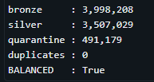

*bronze = silver + quarantine, balanced exactly, zero duplicates*

Rejected rows are never deleted. They are written to a quarantine table with the reason attached, so the counts always reconcile and every rejection is auditable.

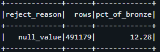

*All 491,179 rejections are null readings, 12.28% of bronze*

### Finding 9: an audit of my own validation rule

**This is the most important result in the project.**

The initial validation quarantined all negative concentrations as physically impossible. Rather than accepting the rule, its effect was measured.

Because every negative was a low reading, removing them raised every average:

| Pollutant | Mean with rule | Mean after fix | Overstatement |
|---|---|---|---|
| PM2.5 | 7.196 | 6.324 | **12.1%** |
| NO2 | 0.685 | 0.636 | 7.2% |
| OZONE | 1.784 | 1.755 | 1.6% |
| PM10 | 15.593 | 15.356 | 1.5% |

The negatives were traced to sub-detection-limit measurements — a documented characteristic of particulate instruments, not sensor faults. The rule was changed to floor at zero and flag as `below_detection` while retaining the raw value.

PM10 showed only 1.5% bias despite similar absolute negatives, because its mean is more than twice PM2.5's, making the same shift proportionally smaller.

A separate hypothesis, that the −10.0 floor in the PM2.5 distribution was an instrument clamp, was tested and rejected: only 99 of 80,774 negative readings sat near that value.

**Below detection, retained and flagged rather than discarded:**

| Pollutant | Rows | % of readings |
|---|---|---|
| PM2.5 | 80,774 | 9.14 |
| NO2 | 55,470 | 6.46 |
| OZONE | 13,604 | 1.57 |
| PM10 | 11,611 | 1.29 |

### Finding 11: a detector with a 100% false positive rate

A flatline detector was built to catch sensors reporting an identical value for hours, which is the classic continuous-analyser failure mode. It returned **4,287 runs**.

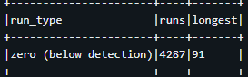

*Every one of the 4,287 runs sits at value 0.0*

All of them were artifacts of the floor-at-zero rule from finding 9. Flooring negatives converts below-detection periods into apparent flatlines, and PM2.5 alone is 9.14% below detection.

Re-running identical logic against the raw `value` column, excluding zeros:

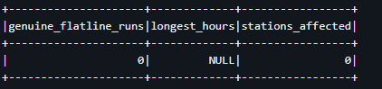

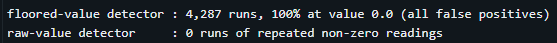

*4,287 false positives against zero genuine runs*

No instrument in the network repeated an identical non-zero reading for six or more consecutive hours across the full six years. The detector's entire output was created by a preprocessing decision made upstream of it.

### All findings

| # | Finding | Handling |
|---|---|---|
| 1 | Parameters are published in both measurement units and `count` units | Avoided by requesting hourly averages only |
| 2 | Region names are inconsistently capitalised in the source ("Sydney North-west" and "Sydney north-west" both occur) | Normalised with `initcap(lower())`, preventing one region splitting into two |
| 3 | Two Sydney "stations" are regional aggregates, not physical sites | Identified by null coordinates and a `SiteName` identical to `Region`. Excluded, preventing double-counting in every regional average |
| 4 | A separate DustWatch network shares parameter names with a `d` suffix | Out of scope, not requested |
| 5 | The `Hour` column is 1-based, not 0-based | `HourDescription` for Hour=1 reads "12 am - 1 am". Corrected before timestamp construction. Verified independently against the NO2 diurnal profile, which peaks at hours 6–7 — a shifted timestamp would not produce the traffic pattern |
| 6 | The API treats `EndDate` as exclusive | Detected by a constant 24-record shortfall across three different window sizes. Uncorrected it would have silently lost one day per station-pollutant-year |
| 7 | 5 of 24 stations returned no data for any pollutant, 2020–2025 | Documented: Lindfield, Chullora, Bargo, Vineyard, Macarthur |
| 8 | 12.28% of readings are null | Quarantined with a reason, never silently dropped |
| 9 | **My own validation rule biased averages by up to 12.1%** | Rule changed to floor and flag rather than discard |
| 10 | NO2 and ozone standards use 1-hour and 4-hour averaging periods, not daily | Dropped from exceedance analysis rather than compared against daily means. Comparing them would have been a category error, and produced a silent zero |
| 11 | **The flatline detector had a 100% false positive rate** | Diagnosed as an artifact of the floor-at-zero rule. Re-run against raw values, returning zero genuine flatlines |
| 12 | The 7-day rolling baseline can be blind to sustained events | On 12 January 2020 the network averaged 47.1 µg/m³ PM2.5, nearly twice the daily standard, with zero stations flagged. See the parameter sweep for what this does and does not mean |

---

## Orchestration

A four-task Databricks Job, each task depending on the one before:

```
ingest_bronze → build_silver → quality_check → build_gold
```

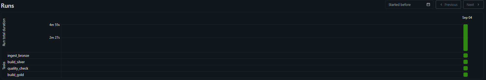

*Four tasks, sequential dependencies, 4m 55s end to end*

The quality check runs five gates and raises an exception on failure, which marks the task failed and **skips** every downstream task:

| Check | Fails when |
|---|---|
| Reconciliation | bronze does not equal silver plus quarantine |
| Grain | any site-parameter-hour appears more than once |
| Volume | silver row count moves more than 10% from the previous run |
| Null keys | any grain-defining column contains a null |
| Quarantine rate | rejections exceed 25% of bronze |

The volume check writes its own history to a `run_log` table, because a Python variable would not survive between job runs.

**The gate was tested by deliberately inverting the reconciliation condition.** In that run, `quality_check` failed and `build_gold` showed as **skipped** rather than failed. The distinction matters: the gate did not merely report a problem, it prevented downstream work from running on data it did not trust.

---

## Anomaly and event detection

### Point-level anomalies

Every reading is scored against a rolling 7-day baseline for the **same station and the same pollutant**, excluding the current reading from its own baseline. A global threshold would fail twice over: it would flag every reading at a genuinely polluted station, and miss a quiet station doubling from 5 to 10.

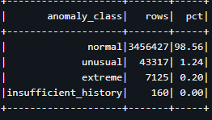

| Class | Rows | % |
|---|---|---|
| normal | 3,456,427 | 98.56 |
| unusual (\|z\| > 3) | 43,317 | 1.24 |
| extreme (\|z\| > 5) | 7,125 | 0.20 |
| insufficient_history | 160 | 0.00 |

**Sensor health**, rolled up to station-month:

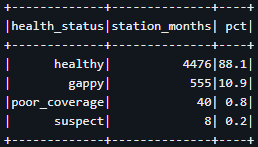

| Status | Station-months | % |
|---|---|---|
| healthy | 4,476 | 88.1 |
| gappy | 555 | 10.9 |
| poor_coverage | 40 | 0.8 |
| suspect | 8 | 0.2 |

### Fault versus event discrimination

> An anomaly at a single station is an instrument problem. The same anomaly occurring simultaneously across many stations is a real air quality event.
>
> **Sensor faults are independent. Air masses are not.**

Each hour is classified by what fraction of reporting stations were simultaneously anomalous. Thresholds are expressed as a fraction rather than a fixed count, because the number of active stations varies year to year.

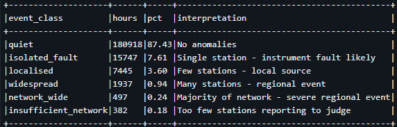

| Class | Hours | % | Interpretation |
|---|---|---|---|
| quiet | 180,918 | 87.43 | No anomalies |
| isolated_fault | 15,747 | 7.61 | One station only — instrument problem |
| localised | 7,445 | 3.60 | Under 25% — a nearby source |
| widespread | 1,937 | 0.94 | 25–50% — regional event |
| network_wide | 497 | 0.24 | Over 50% — severe regional event |
| insufficient_network | 382 | 0.18 | Fewer than 3 stations reporting |

Isolated single-station anomalies outnumber genuine regional events by roughly **6.5 to 1**. Treating both as "outliers" would have misattributed the overwhelming majority.

### January 2020 as a validation target

Sydney experienced severe bushfire smoke through the 2019–20 Black Summer. It is visible in the regional trend table without any detection logic:

| Month | Sydney East | North-west | South-west |
|---|---|---|---|
| **Jan 2020** | **20.24** | **21.10** | **25.36** |
| Feb 2020 | 6.28 | 6.19 | 6.86 |
| Mar 2020 | 4.93 | 4.96 | 5.67 |

Three to four times the following months, simultaneously across all three regions.

**The rolling-baseline detector ranked January 2020 second**, not first: 36 event hours against August 2020's 40, and it does not appear among the 15 longest episodes. The day-by-day breakdown shows why:

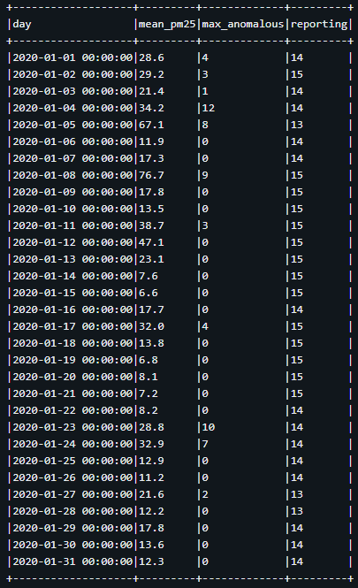

*8 January: 76.7 µg/m³, 9 stations flagged. 12 January: 47.1 µg/m³, zero stations flagged*

By mid-January the seven-day baseline had absorbed the smoke, and a day averaging nearly twice the daily standard produced no anomalies at all.

**A seasonal baseline caught it decisively.** Comparing each reading against the same calendar month in other years at the same station:

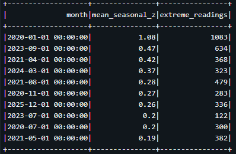

| Month | Mean seasonal z | Extreme readings |
|---|---|---|
| **Jan 2020** | **1.08** | **1,083** |
| Sep 2023 | 0.47 | 634 |
| Apr 2021 | 0.42 | 368 |

More than double the next month on both measures.

### Parameter sweep (MLflow)

Twenty configurations were tracked in MLflow: five z-score thresholds across four baseline window sizes, measuring how many January 2020 anomalies each detected.

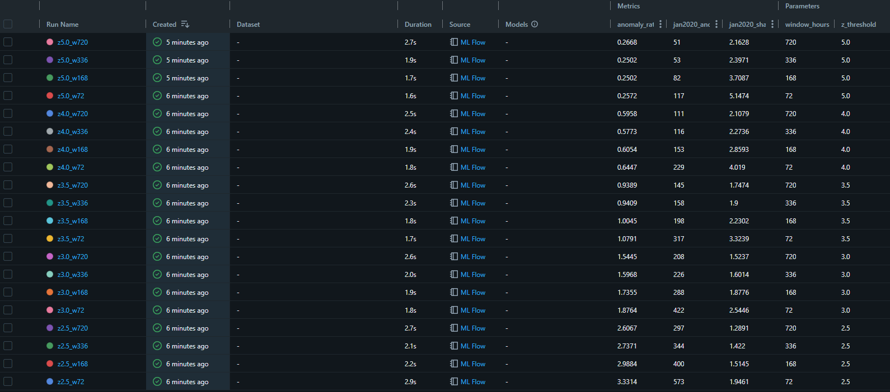

*Twenty runs across five thresholds and four window sizes*

**The result contradicted the hypothesis.** I expected wider windows to recover the detections lost to baseline adaptation. They did the opposite.

| Window | Jan 2020 anomalies (z=2.5) | Share of all anomalies | Overall anomaly rate |
|---|---|---|---|
| 72h | 573 | 1.95% | 3.33% |
| 168h | 400 | 1.51% | 2.99% |
| 336h | 344 | 1.42% | 2.74% |
| 720h | 297 | 1.29% | 2.61% |

Monotonic decline on both measures, at every threshold tested. A wider window admits more variety, inflates the baseline standard deviation, and suppresses detections everywhere — the overall anomaly rate falls alongside the January 2020 count.

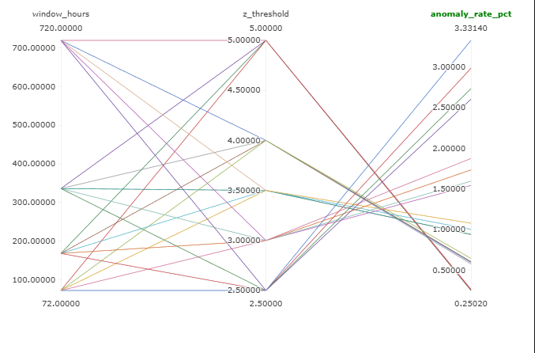

**What this means.** The specific 12 January observation stands: at the seven-day setting, a day averaging 47.1 µg/m³ produced no flags. But that is not fixed by lengthening the window. It is fixed by changing the *construction* of the baseline — the seasonal comparison, which is built from different years rather than a longer stretch of the same one.

**The most useful configuration** for isolating extreme events was the strictest threshold with the shortest window: z = 5.0 at 72 hours gave January 2020 a 5.15% share of all anomalies, four times the worst configuration's 1.29%.

The choice of baseline determines what a detector can see, and a longer window is not the same thing as a better one.

---

## What the data says

Four findings from the gold layer. Each names the number, and each names its caveat.

### Sydney's fine particulate burden is close to uniform

| Region | PM2.5 | PM10 | Stations |
|---|---|---|---|
| Sydney North-west | 6.71 | 16.12 | 6 |
| Sydney South-west | 6.49 | 14.77 | 5 |
| Sydney East | 6.46 | 15.29 | 8 |

PM2.5 varies by 3.9% across all three regions, PM10 by 9.1%. The intuition that outer suburbs carry measurably worse fine particulate air is not supported at this resolution.

**Caveat:** station counts differ (8, 6, 5), so each regional mean rests on a different sample. The spread between regions is small enough that station placement could account for it.

### There is no clear trend, 2020 to 2025

| Year | PM2.5 | PM10 | NO2 | OZONE |
|---|---|---|---|---|
| 2020 | 8.01 | 17.80 | 0.65 | 1.84 |
| 2021 | 6.75 | 15.18 | 0.60 | 1.69 |
| 2022 | **5.02** | **12.16** | 0.58 | 1.58 |
| 2023 | 6.79 | 15.86 | 0.71 | 1.70 |
| 2024 | 6.55 | 16.10 | 0.67 | 1.80 |
| 2025 | 6.31 | 15.56 | 0.63 | 1.90 |

PM2.5 falls 37% from 2020 to 2022, then returns to roughly 6.3–6.8 and stays there. The movement is not monotonic and is not a trend.

**Caveat, and it is the important part:** 2020 is elevated by bushfire smoke, and 2022 is an outlier low across all four pollutants simultaneously. Quoting "PM2.5 fell 21% from 2020 to 2025" would be technically accurate and substantively misleading, because it is an artifact of the starting point. Separating a genuine trend from year-to-year meteorological variation would require weather covariates this dataset does not contain.

### Half of all PM2.5 exceedance days occurred in one year

| Year | PM10 days | PM2.5 days |
|---|---|---|
| 2020 | 132 | 144 |
| 2021 | 18 | 52 |
| 2022 | 0 | 0 |
| 2023 | 17 | 54 |
| 2024 | 1 | 6 |
| 2025 | 18 | 16 |

2020 accounts for **144 of 272 PM2.5 exceedance days** across the full six years, and 132 of 186 PM10 days. 2022 recorded none at all.

**Caveat:** the thresholds used are illustrative NEPM-style values (25 µg/m³ PM2.5, 50 µg/m³ PM10), not cited regulatory figures, and days with under 75% hourly completeness are excluded.

### NO2 carries a clear traffic signature

| Hour | Mean NO2 (pphm) |
|---|---|
| 06 | **0.953** (morning peak) |
| 07 | 0.952 |
| 13 | **0.375** (daily minimum) |
| 20 | 0.835 |
| 21 | 0.837 (evening plateau) |

The morning peak is 2.5 times the early-afternoon minimum. The shape matches the expected mechanism: traffic emissions accumulate under a shallow overnight boundary layer, midday sunlight and vertical mixing break NO2 down, and it re-accumulates through the evening.

**Caveat:** the evening rise is a broad plateau rather than a sharp peak, and does not reach the morning maximum. Attributing the pattern specifically to traffic rather than to boundary-layer dynamics would require co-located traffic counts.

This profile also served as an independent verification of the timestamp handling in finding 5. A one-hour offset error would have shifted the entire curve, and the physics would no longer line up.

---

## Repository structure

```
notebooks/
  01_ingest_bronze.py          API ingestion, manifest, bronze table
  02_silver_layer.py           Flatten, type, validate, split
  03_gold_layer.py             Aggregations and exceedances
  04_quality_check.py          Five gates, raises on failure
  05_anomaly_detection.py      Rolling z-scores, flatline, sensor health
  06_event_detection.py        Network concurrence, episodes, seasonal baseline
  07_flatline_raw.py           Flatline re-run on raw values
  08_mlflow_threshold_sweep.py Parameter sweep, tracked in MLflow
  09_insights.py               Analytical queries
docs/images/                   Screenshots
README.md
```

---

## Limitations

| Limitation | Note |
|---|---|
| Databricks Free Edition | Non-commercial licence. Not a production deployment |
| Serverless compute only | No cluster configuration, therefore no performance tuning claims |
| Batch, not streaming | The source updates hourly; batch is appropriate at this scale |
| NO2 and ozone excluded from exceedance analysis | Their standards use 1-hour and 4-hour averaging periods |
| Exceedance thresholds are illustrative | NEPM-style values, not cited regulatory figures |
| 5 of 24 stations returned no data | Lindfield, Chullora, Bargo, Vineyard, Macarthur |
| 12.28% of readings null | Station downtime and instruments not present at every site |
| Flatline detection returns nothing usable | See finding 11. The zero result is real, but at a six-hour threshold only |
| No weather covariates | Year-to-year variation cannot be separated from meteorology |
| No dashboard yet | Gold tables are modelled for BI consumption; the serving layer is in progress |

---

## Running it

**Platform:** Databricks Free Edition, serverless compute, the `workspace` catalog.

Note that `CREATE CATALOG` fails on Free Edition with a metastore storage error, which is why the schemas are prefixed `aq_` inside the pre-existing `workspace` catalog rather than living in a catalog of their own.

**Order:** `01` → `02` → `04` → `03`, matching the scheduled job. Notebooks `05` through `09` run after gold exists and are independent of each other.

Notebooks must be attached to **Serverless** compute, not a SQL Warehouse. A warehouse has no Python engine and will fail with an execution-context error.

---

## Notes on method

Three findings in this project came from auditing my own work rather than the source data: a validation rule that biased averages by 12.1%, a flatline detector with a 100% false positive rate, and a parameter sweep that contradicted my own hypothesis about baseline adaptation.

Every number in this README is re-derivable from a query in the committed notebooks. Anything that could not be re-run was removed rather than softened.
