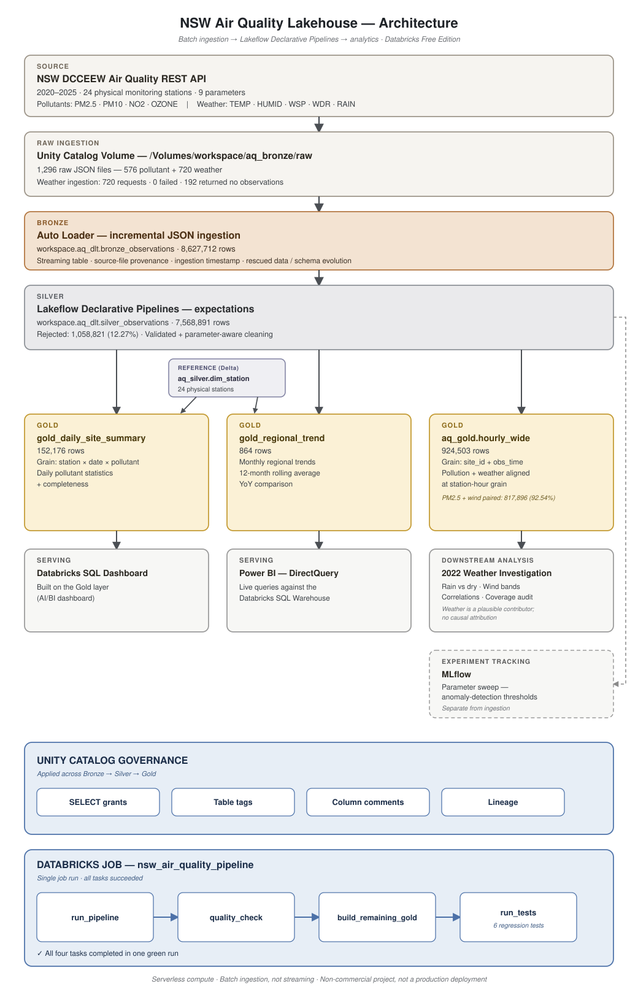

# Architecture

A batch lakehouse over the NSW DCCEEW Air Quality REST API, 2020–2025, covering 24
physical Sydney monitoring stations and 9 parameters (4 pollutants, 5 weather).
Data moves through a medallion pipeline — Bronze, Silver, Gold — orchestrated by a
single Databricks Job and governed end-to-end through Unity Catalog.

---

## Layers

**Source.** The NSW DCCEEW Air Quality REST API, queried in station/parameter/year
chunks for 2020–2025. This is a request/response REST API, not a streaming feed.

**Raw ingestion.** Each chunk is landed unchanged as JSON in a Unity Catalog Volume
(`/Volumes/workspace/aq_bronze/raw`) — 1,296 files: 576 pollutant files and 720
weather files. Weather ingestion made 720 requests with 0 failures; 192 returned no
observations for that station-parameter-year (the station or instrument simply
wasn't active, not an error).

**Bronze.** Auto Loader incrementally reads the landed JSON into
`workspace.aq_dlt.bronze_observations` (8,627,712 rows) as a streaming table, adding
source-file provenance and an ingestion timestamp, with rescued-data handling for
schema evolution. Nothing is cleaned or reshaped here.

**Silver.** A Lakeflow Declarative Pipeline flattens the nested API structure,
corrects the 1-based API hour field, constructs `obs_time`, and applies named
expectations into `workspace.aq_dlt.silver_observations` (7,568,891 rows; 1,058,821
rejected, a 12.27% drop rate). Cleaning is parameter-aware: negative pollutant
readings represent below-detection measurements and are floored at zero (flagged
`below_detection`), while legitimate negative weather values — including sub-zero
temperatures — are preserved unchanged.

**Reference dimension.** `workspace.aq_silver.dim_station` (24 stations) is a small
Delta reference table joined into the aggregate Gold models for station metadata
(name, region, coordinates). It is not a source for Silver.

**Gold.** Three tables built from Silver:
- `gold_daily_site_summary` (152,176 rows) — daily pollutant statistics and hourly
  completeness, grain: station × date × pollutant.
- `gold_regional_trend` (864 rows) — monthly regional trends with a 12-month rolling
  average and year-over-year comparison.
- `aq_gold.hourly_wide` (924,503 rows) — pollution and weather aligned at
  station-hour grain (`site_id` + `obs_time`), including 817,896 hours with paired
  PM2.5 and wind (92.54% of PM2.5 coverage).

**Downstream analysis.** `hourly_wide` supports a 2022 weather investigation: rain
vs. dry conditions, wind-speed bands, correlations, and a coverage audit. Weather is
treated as a plausible contributor to pollutant variation; no causal attribution is
claimed.

**Serving.** A Databricks AI/BI (SQL) dashboard is built on the Gold layer, and
Power BI Desktop connects over DirectQuery, issuing live queries against the
Databricks SQL Warehouse rather than an imported extract.

**Experiment tracking.** MLflow tracks a parameter sweep over anomaly-detection
thresholds. This is a separate analytical experiment, not part of the ingestion
pipeline.

**Orchestration.** A single Databricks Job (`nsw_air_quality_pipeline`) runs the
pipeline end-to-end: `run_pipeline → quality_check → build_remaining_gold →
run_tests`. `run_tests` executes six regression tests covering the API hour
correction, Bronze/Silver accounting, Silver grain uniqueness, pollutant/weather
cleaning semantics, `hourly_wide` grain, and humidity preservation/filtering
semantics. All four tasks completed successfully in the current run.

**Governance.** Unity Catalog governs the pipeline throughout: `SELECT` grants on
the Gold tables, descriptive table tags (domain, layer, source, refresh cadence),
verified column comments on `silver_observations` and `hourly_wide`, and lineage
tracked automatically across Bronze → Silver → Gold.

---

## Notes and limitations

- Batch ingestion on a schedule, not a streaming/live feed — the source is a REST
  API, and "Auto Loader" here means incremental batch/micro-batch file discovery,
  not a message broker.
- Runs on Databricks Free Edition, serverless compute. Non-commercial, not a
  production deployment.
- 24 is the count of physical monitoring stations; the subset of stations with
  paired PM2.5 and wind coverage in `hourly_wide` is a different, smaller number and
  is not shown on this diagram.
